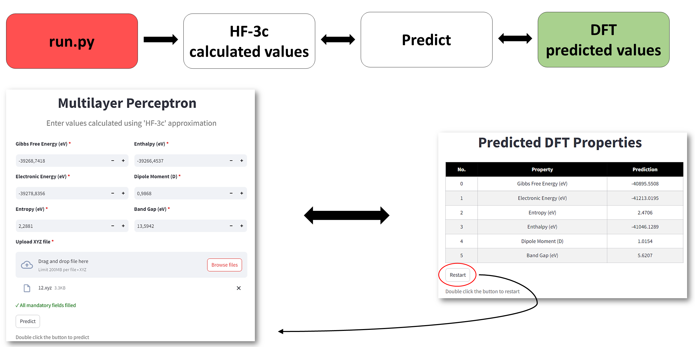

# Dataset description

The data represents the energy values of supramolecular systems, which were calculated using two different quantum chemical approximations. The "HF" (Hartree-Fock) set was calculated using a fast and inaccurate approximation, while "DFT" (Density Functional Theory) was calculated using a resource-intensive but accurate approximation.

Feature  | Feature Type | Description
-------------------|--------------------|--------------------
dft_gibbs_free_energy_ev       |Target| Gibbs free energy of the supramolecular system, calculated using the DFT approximation 
dft_electronic_energy_ev       |Target| Electronic energy of the supramolecular system, calculated using the DFT approximation
dft_entropy_ev       |Target| Entropy of the supramolecular system, calculated using the DFT approximation
dft_enthalpy_ev       |Target| Enthalpy of the supramolecular system, calculated using the DFT approximation
dft_dipole_moment_d       |Target| Dipole moment of the supramolecular system, calculated using the DFT approximation
dft_gap_ev      |Target| Energy gap between HOMO and LUMO, calculated using the DFT approximation
hf_gibbs_free_energy_ev       |Training| Gibbs free energy of the supramolecular system, calculated using the HF approximation 
hf_electronic_energy_ev       |Training| Electronic energy of the supramolecular system, calculated using the HF approximation
hf_entropy_ev       |Training| Entropy of the supramolecular system, calculated using the HF approximation
hf_enthalpy_ev       |Training| Enthalpy of the supramolecular system, calculated using the HF approximation
hf_dipole_moment_d       |Training| Dipole moment of the supramolecular system, calculated using the HF approximation
hf_gap_ev      |Training| Energy gap between HOMO and LUMO, calculated using the HF approximation

# How to make your own predictions ? 

1) Download the project (all models were built using Python 3.12.0)
2) Install all libraries listed in "requirements.txt":
   => _**pip install -r "requirements.txt"**_
4) If you face any issues while installing dependencies via "requirements.txt" using "pip",
   then you can use "conda" to activate the "environment.yml":
   => _**conda env create -n hf_dft -f environment.yml**_
6) Then you need to activate the "hf_dft" environment:
   => _**conda activate hf_dft**_   
8) Navigate to the "output" folder of the respective model
9) Run the "run.py" file in command prompt:
    => _**streamlit run run.py**_
11) Upload necessary data to make prediction

