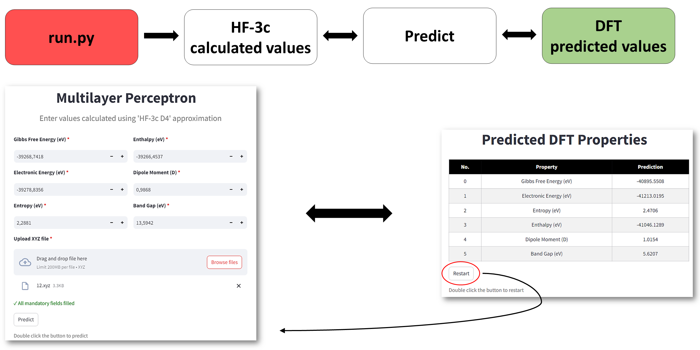

# Cite the Manuscript
Normatov, S.; Nesterov, P. V.; Aliev, T. A.; Timralieva, A. A.; Novikov, A. S.; Skorb, E. V. Search for correlations between the results of the density functional theory and Hartree–Fock calculations using neural networks and classical machine learning algorithms. ACS Omega 2025. https://doi.org/10.1021/acsomega.4c09861.

# Manuscript URL
https://pubs.acs.org/doi/full/10.1021/acsomega.4c09861

# Dataset description

The data represents the energy values of supramolecular systems, calculated using two Quantum Chemical approximations. The "hf_" (Hartree-Fock) set was calculated using fast but inaccurate approximation, while "dft_" (Density Functional Theory) set was calculated using accurate yet time-consuming approximation.

Feature  | Type | Level of theory
-------------------|--------------------|--------------------
dft_gibbs_free_energy_ev       |Target| Gibbs free energy of the supramolecular system, calculated using the DFT
dft_electronic_energy_ev       |Target| Electronic energy of the supramolecular system, calculated using the DFT
dft_entropy_ev       |Target| Entropy of the supramolecular system, calculated using the DFT
dft_enthalpy_ev       |Target| Enthalpy of the supramolecular system, calculated using the DFT
dft_dipole_moment_d       |Target| Dipole moment of the supramolecular system, calculated using the DFT
dft_gap_ev      |Target| Energy gap between HOMO and LUMO, calculated using the DFT
hf_gibbs_free_energy_ev       |Training| Gibbs free energy of the supramolecular system, calculated using the HF
hf_electronic_energy_ev       |Training| Electronic energy of the supramolecular system, calculated using the HF
hf_entropy_ev       |Training| Entropy of the supramolecular system, calculated using the HF
hf_enthalpy_ev       |Training| Enthalpy of the supramolecular system, calculated using the HF
hf_dipole_moment_d       |Training| Dipole moment of the supramolecular system, calculated using the HF
hf_gap_ev      |Training| Energy gap between HOMO and LUMO, calculated using the HF

# How to make your own predictions ? 

1) Download the project (all models were built using Python 3.12.0)
2) Install all libraries listed in "requirements.txt": _**pip install -r "requirements.txt"**_
3) If you face any issues while installing dependencies via "requirements.txt" using "pip", then you can use "conda" to activate the "environment.yml": _**conda env create -n hf_dft -f environment.yml**_
4) Then you need to activate the "hf_dft" environment: _**conda activate hf_dft**_   
5) Navigate to the "output" folder of the respective model
6) Run the "run.py" file in command prompt: _**streamlit run run.py**_
7) Upload necessary data to make prediction

